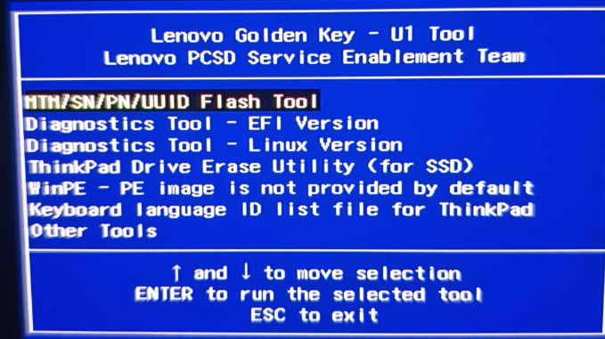
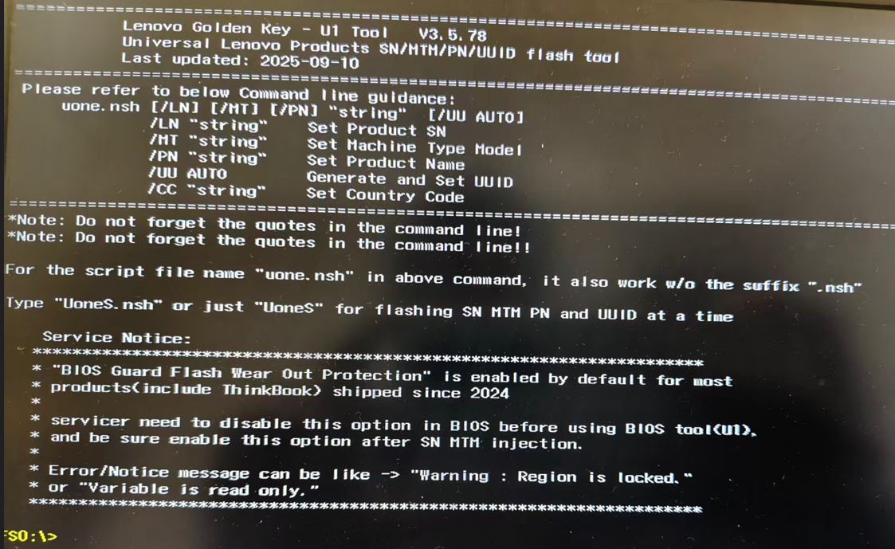

## 1. 格式化U盘为FAT32

下载软件：<https://nth2miss.lanzoue.com/ieqty36p8m0f>

解压后打开：

插入U盘后，双击运行 `usbfmtpw.exe`：

检查 Drive 盘号是否和你此电脑里 U 盘的盘号一致。

点击 start 开始格式化。

---

## 2. 烧录U盘

解压 U1 Key Updater：

双击 `U1.exe` 打开：

选择 U 盘的盘号，点击 update 烧录。

---

### 注意事项：

① **Cloud ver**：是云端版本号，如果这边是空白的，说明你的网络有问题，建议换个网络，或者换台电脑进行烧录。

② **Local ver**：是本地版本号，也就是你烧录进 U 盘的版本号，第一次打开软件后面是空白的（上面截图是已经烧录好了的）。

## 3.U盘启动

进入Bios关闭安全启动：https://www.baidu.com/s?ie=UTF-8&wd=bios%E5%85%B3%E9%97%AD%E5%AE%89%E5%85%A8%E5%90%AF%E5%8A%A8

然后开机选择U盘启动：https://www.wepe.com.cn/ubook/bootpe.html

## 4.U1 Tool

这边不用操作，等待5秒，到下图界面

选择第一个

进入到这个界面，可以一键修改或者只修改你想要的

举例：

①修改SN：uone.nsh /LN xxxxxxx

| 命令      | 说明      |
|:---------------: | :---------------------: |
| /LN "string"       | 设置产品序列号      |
| /MT "string"       | 设置机器型号       |
| /PN "string" | 设置产品名称        |
| /UU AUTO     | 自动生成并设置 UUID |
| /CC "string" | 设置国家/地区代码   |

②一键修改
输入命令：UoneS
按照图里标注的进行修改

