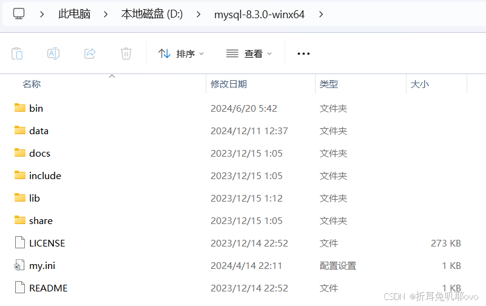
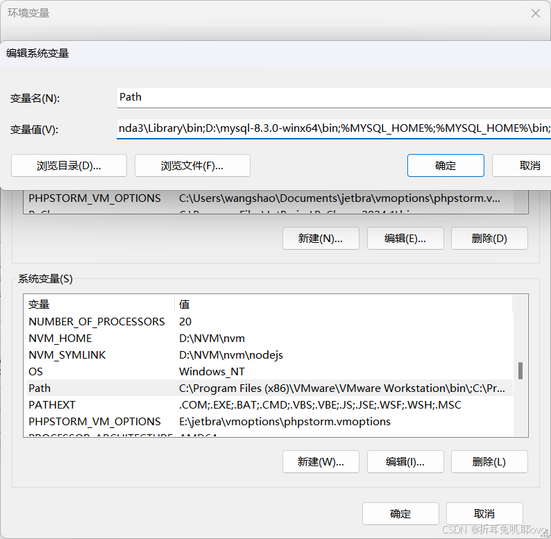
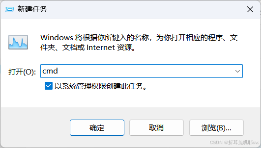
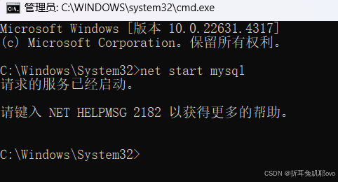
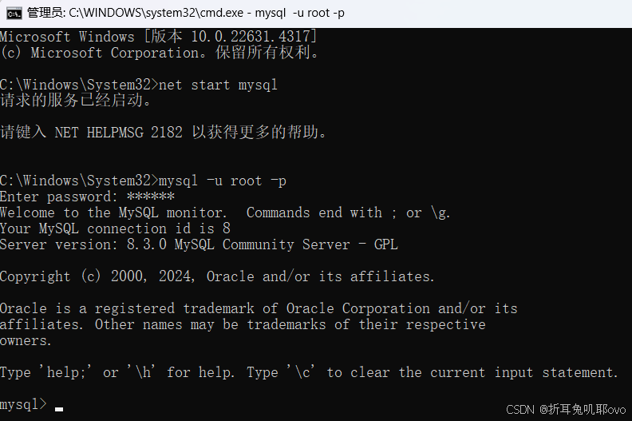

网上的教程有很多，基本上大同小异。但是安装软件有时就可能因为一个细节安装失败。我也是综合了很多个教程才安装好的，所以本教程可能也不是普遍适合的。

安装环境：[win11](https://so.csdn.net/so/search?q=win11&spm=1001.2101.3001.7020)

## 1、下载zip安装包：

MySQL8.0 For Windows zip包下载地址：[MySQL Community Downloads](https://dev.mysql.com/downloads/mysql/)，进入页面后可以不登录。后点击底部“No thanks, just start my download.”即可开始下载。

## 2、安装

### 2.1 解压zip包到安装目录

我解压在了D:\mysql-8.3.0-winx64

解压后的文件目录




### 2.2 配置环境变量




　　　　将解压文件夹下的bin路径添加到变量值中，前后以 ; 开头结尾

### 2.3 配置初始化的my.[ini文件](https://so.csdn.net/so/search?q=ini文件&spm=1001.2101.3001.7020)

 　　　我们发现解压后的目录并没有my.ini文件，没关系可以自行创建。在安装根目录下添加 my.ini（新建文本文件，将文件类型改为.ini），写入基本配置：


```cobol
[mysqld]
# 设置3306端口
port=3306
# 设置mysql的安装目录 ----------是你的文件路径-------------
basedir=D:\mysql-8.3.0-winx64
# 设置mysql数据库的数据的存放目录 ---------是你的文件路径data文件夹自行创建
datadir=D:\mysql-8.3.0-winx64\data
# 允许最大连接数
max_connections=200
# 允许连接失败的次数。
max_connect_errors=10
# 服务端使用的字符集默认为utf8mb4
character-set-server=utf8mb4
# 创建新表时将使用的默认存储引擎
default-storage-engine=INNODB
# 默认使用“mysql_native_password”插件认证
#mysql_native_password
default_authentication_plugin=mysql_native_password
#禁用sqlmode模式
sql_mode=''
 
[mysql]
# 设置mysql客户端默认字符集
default-character-set=utf8mb4
[client]
# 设置mysql客户端连接服务端时默认使用的端口
port=3306
default-character-set=utf8mb4
```


注意：其中的data目录不需要创建，下一步初始化工作中会自动创建。

## 3、安装mysql

在安装时，必须以管理员身份运行cmd，否则在安装时会报错，会导致安装失败的情况




### 3.1 初始化数据库

在MySQL安装目录的 bin 目录下执行命令：

```scss
mysqld --initialize --console
```

执行完成后，会打印 root 用户的初始默认密码，比如：

> ```
> C:\Users\Administrator>cd C:\Program Files\MySQL\bin
> 
> C:\Program Files\MySQL\bin>mysqld --initialize --console
> 2018-04-28T15:57:17.087519Z 0 [System] [MY-013169] [Server] C:\Program Files\MySQL\bin\mysqld.exe (mysqld 8.0.11) initializing of server in progress as process 4984
> 2018-04-28T15:57:24.859249Z 5 [Note] [MY-010454] [Server] A temporary password is generated for root@localhost: rI5rvf5x5G,E
> 2018-04-28T15:57:27.106660Z 0 [System] [MY-013170] [Server] C:\Program Files\MySQL\bin\mysqld.exe (mysqld 8.0.11) initializing of server has completed
> 
> C:\Program Files\MySQL\bin>
> ```


```
　　注意！执行输出结果里面有一段： [Note] [MY-010454] [Server] A temporary password is generated for root@localhost: rI5rvf5x5G,E 其中root@localhost:后面的“rI5rvf5x5G,E”就是初始密码（不含首位空格）。在没有更改密码前，需要记住这个密码，后续登录需要用到。
```


　　要是你关快了，或者没记住，那也没事，删掉初始化的 datadir 目录，再执行一遍初始化命令，又会重新生成的。当然，也可以使用安全工具，强制改密码，用什么方法，自己随意。

参考：https://dev.mysql.com/doc/refman/8.0/en/data-directory-initialization-mysqld.html

### 3.2 安装服务

在MySQL安装目录的 bin 目录下执行命令：

```scss
mysqld --install [服务名]
```

后面的服务名可以不写，默认的名字为 mysql。当然，如果你的电脑上需要安装多个MySQL服务，就可以用不同的名字区分了，比如 mysql8 和 mysql9。

安装完成之后，就可以通过命令**net start mysql**启动MySQL的服务了。通过命令**net stop mysql**停止服务。通过命令`**sc delete MySQL/mysqld -remove**卸载 MySQL 服务`




##  4、更改密码

在MySQL安装目录的 bin 目录下执行命令：

```css
mysql -u root -p
```


　　这时候会提示输入密码，记住了上面第3.1步安装时的密码，填入即可登录成功，进入MySQL命令模式。




在MySQL中执行命令：

```sql
ALTER USER 'root'@'localhost' IDENTIFIED WITH mysql_native_password BY '新密码';  
```

修改密码，注意命令尾的**；**一定要有，这是mysql的语法


**到此，安装部署就完成了。**


可以用 命令查看一下默认安装的数据库： 

```sql
show databases;

use mysql;

show tables;
```

> ```
> mysql> show databases;
> +--------------------+
> | Database           |
> +--------------------+
> | information_schema |
> | mysql              |
> | performance_schema |
> | sys                |
> +--------------------+
> 4 rows in set (0.01 sec)
> 
> mysql>
> ```


看到默认初始化了mysql数据库，其中user表里面存储MySQL用户信息。我们可以看一下默认MySQL用户：

```sql
 select user,host,authentication_string from mysql.user;
```

> ```
> mysql> select user,host,authentication_string from mysql.user;
> +------------------+-----------+-------------------------------------------+
> | user             | host      | authentication_string                     |
> +------------------+-----------+-------------------------------------------+
> | mysql.infoschema | localhost | *THISISNOTAVALIDPASSWORDTHATCANBEUSEDHERE |
> | mysql.session    | localhost | *THISISNOTAVALIDPASSWORDTHATCANBEUSEDHERE |
> | mysql.sys        | localhost | *THISISNOTAVALIDPASSWORDTHATCANBEUSEDHERE |
> | root             | localhost | *27C237A977F4F44D3F551F1A673BE14DFD232961 |
> +------------------+-----------+-------------------------------------------+
> 4 rows in set (0.00 sec)
> 
> mysql> 
> ```