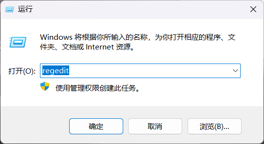
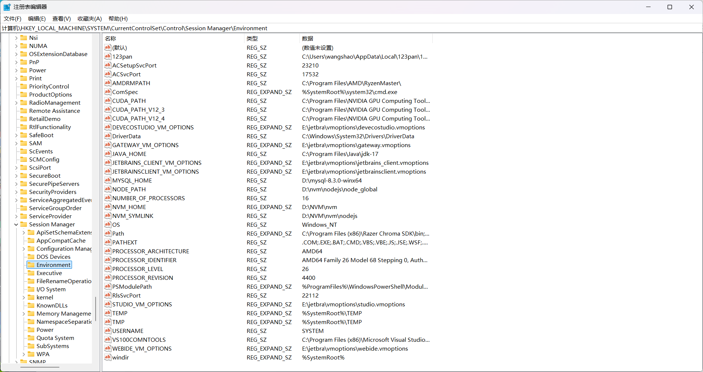
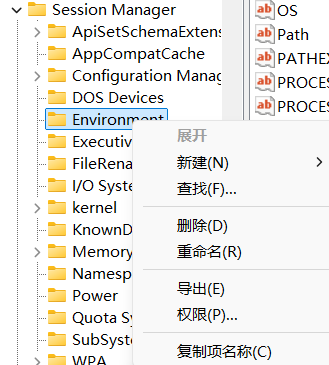

Win+R打开注册表

## 第一步：Win+R打开注册表

## 第二步：导出系统环境变量

定位到 HKEY_LOCAL_MACHINE\SYSTEM\CurrentControlSet\Control\Session Manager\Environment

这就是存储**系统环境变量**的注册表了

左侧文件树中，右键Environment，选择导出

导出后选择合适的位置保存

## 第三步：导出用户环境变量

注册表定位到 HKEY_CURRENT_USER\Environment 

同样的操作，对Environment进行导出

## 注意事项

部分软件的环境存在users目录下，重装系统的用户名与原用户名应一致

博主多次重装系统都这样备份环境，实测下来，旧系统安装了某个软件，新系统没有安装这个软件，导入环境变量，并没有对系统造成影响